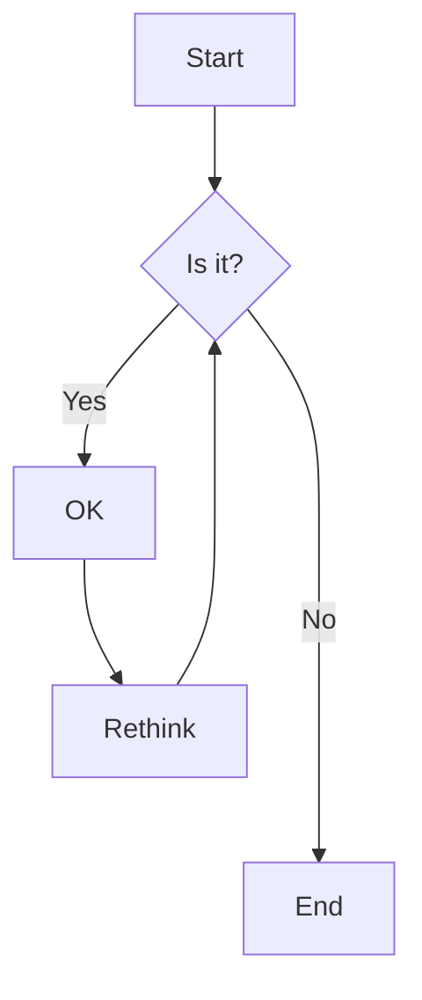
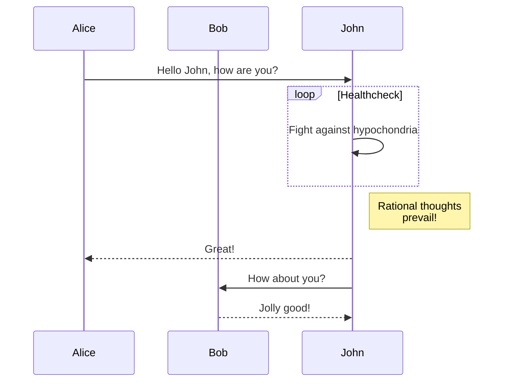

# Mermaid.js in Astro

This is an example of how to use Mermaid.js in your Astro blog posts.

## Flow Chart

## Sequence Diagram

This demonstrates that we can now use Mermaid.js diagrams in our Markdown content!